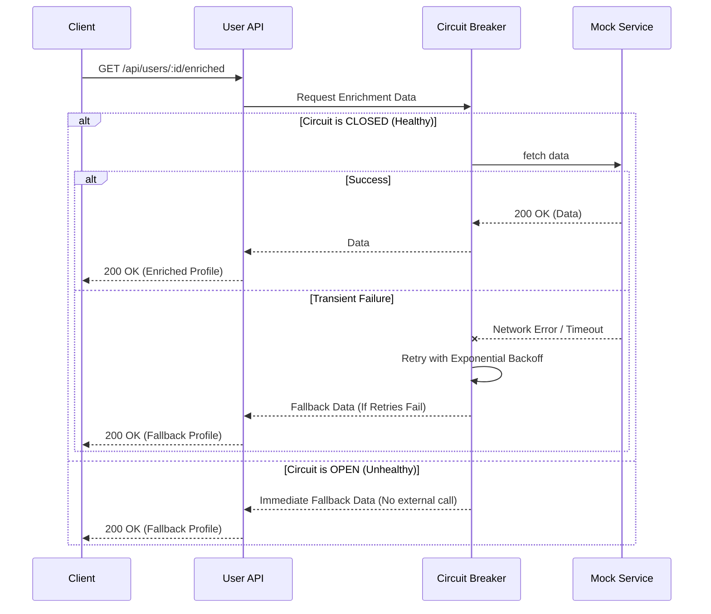

# Resilient User Profile Management API

A robust, fault-tolerant backend API for managing user profiles, built with Node.js, Express, and MongoDB. This API is designed for high availability, demonstrating advanced backend engineering patterns—including the Repository and Unit of Work patterns for data integrity, and Circuit Breaker and Retry patterns for handling external service failures.

## Project Overview
Modern microservice architectures frequently depend on external APIs for data enrichment. This API manages standard CRUD operations for user profiles and enriches them by calling an external mock service (e.g., retrieving loyalty scores and recent activity). To prevent cascading failures when the external service is slow or unresponsive, this API implements state-of-the-art resilience mechanisms to degrade gracefully.

## Architectural Decisions & Patterns

### System Architecture Flow
```mermaid
graph TD
    Client[Client (Postman/UI)] -->|HTTP Request| API[Express API Router]
    API --> Controller[User Controller]
    Controller --> Service[User Service]
    Service --> UOW[Unit of Work]
    UOW --> Repo[User Repository]
    Repo --> DB[(MongoDB)]
    Service --> CB[Circuit Breaker / Retry]
    CB --> ExtService[External Mock Service]
```

### 1. Repository Pattern
- **Implementation**: The `IUserRepository` interface abstracts all database logic, implemented concretely by `MongoUserRepository`.
- **Benefits**: Decouples the business logic (`UserService`) from the Mongoose ODM. This allows for easier unit testing (via mocking the repository) and ensures that migrating to a different database (like PostgreSQL) would not require rewriting the core service layer.
- **Alternatives Considered**: Direct Mongoose usage was considered for speed of development but rejected because it tightly couples the service layer to the database driver, hindering testability.

### 2. Unit of Work Pattern
- **Implementation**: The `MongoUnitOfWork` class manages MongoDB transactions (sessions). It provides `startTransaction`, `commit`, and `rollback` methods.
- **Benefits**: Ensures atomicity for complex operations spanning multiple database documents. If a complex user creation/update flow fails halfway through, all changes are rolled back, maintaining data consistency.
- **Alternatives Considered**: Handling Mongoose sessions manually within the `UserService`. This was rejected because transaction management is an infrastructure concern and clutters the business logic.

### 3. Circuit Breaker Pattern
- **Implementation**: Used the `opossum` library for the `/enriched` endpoint's external HTTP calls.
- **Benefits**: Prevents the system from repeatedly sending requests to a failed external service. When failures cross the `CIRCUIT_BREAKER_FAILURE_THRESHOLD`, the circuit opens, and subsequent requests immediately return a predefined fallback response (`enrichedDataStatus: unavailable`), preserving API responsiveness.

### 4. Retry Pattern
- **Implementation**: Wraps the external API `fetch` call with a custom loop that catches transient network errors and retries up to `RETRY_MAX_ATTEMPTS` times. It utilizes an **exponential backoff** strategy (e.g., 100ms, 200ms, 400ms) to avoid overwhelming a recovering service.
- **Benefits**: Smooths out temporary network glitches without prematurely tripping the Circuit Breaker.

### Resilience Flow (`GET /api/users/:id/enriched`)


## Setup Instructions

### Prerequisites
- Docker and Docker Compose installed on your machine.

### 1. Clone the repository
```bash
git clone https://github.com/SivaGaneshv1729/resilient-user-profile-api.git
cd resilient-user-profile-api
```

### 2. Configure Environment
A `.env.example` file is provided. Create your `.env` file from it:
```bash
cp .env.example .env
```
*(The default configuration works out-of-the-box and includes tuning parameters for the resilience patterns).*

### 3. Run the Application Stack
Use Docker Compose to build and start the API, MongoDB, and the Mock Enrichment Service:
```bash
docker-compose up -d --build
```
> **Note**: The application has an automated seeding script. Upon starting, if the database is empty, it will automatically populate 3 initial user profiles.

## Testing Instructions

The repository includes a comprehensive suite of Unit and Integration tests. The Integration tests utilize `mongodb-memory-server` in Replica Set mode to properly test the Unit of Work transactions, and `jest` mocks to strictly test the resilience strategies without relying on network boundaries.

**To run the test suite:**
If you want to run tests directly inside the Docker container:
```bash
docker-compose exec app npm test
```

## API Documentation

The full OpenAPI 3.0 specification can be found in [`openapi.yaml`](openapi.yaml). Below is an overview of the key endpoints.

### `POST /api/users`
Creates a new user profile.
- **Request Body**:
  ```json
  {
    "name": "Jane Doe",
    "email": "jane.doe@example.com"
  }
  ```
- **Success (201 Created)**:
  ```json
  {
    "id": "uuid-string",
    "name": "Jane Doe",
    "email": "jane.doe@example.com",
    "registrationDate": "2023-01-15T10:00:00Z"
  }
  ```
- **Error (409 Conflict)**: Returned if the email already exists.

### `GET /api/users/{id}`
Retrieves a single user by ID. Returns `200 OK` on success, or `404 Not Found` if the user does not exist.

### `PUT /api/users/{id}`
Updates an existing user.
- **Request Body**:
  ```json
  { "name": "Jane Smith" }
  ```
- **Success (200 OK)**: Returns the updated user object.

### `DELETE /api/users/{id}`
Deletes a user by ID. Returns `204 No Content` on success.

### `GET /api/users/{id}/enriched`
Retrieves the user profile and enriches it with external data.
- **Success (200 OK - Service Healthy)**:
  ```json
  {
    "id": "uuid-string",
    "name": "Jane Doe",
    "email": "jane.doe@example.com",
    "enrichedDataStatus": "available",
    "recentActivity": ["login", "purchase"],
    "loyaltyScore": 450
  }
  ```
- **Success (200 OK - Fallback/Degraded)**: Triggered when the external service consistently fails or times out.
  ```json
  {
    "id": "uuid-string",
    "name": "Jane Doe",
    "email": "jane.doe@example.com",
    "enrichedDataStatus": "unavailable",
    "message": "Enrichment service is currently unavailable."
  }
  ```

## Demonstration

> **[Insert Link to Video Demonstration Here]**

**Demo Highlights:**
1. **CRUD Functionality**: Walkthrough of standard user creation, retrieval, and updates via Postman/cURL.
2. **Resilience Testing**: 
   - Modifying `.env` (`MOCK_SERVICE_FAILURE_RATE=1.0`) to force the mock service to fail.
   - Calling the `/enriched` endpoint and observing the latency as the **Retry** mechanism kicks in for the first few requests.
   - Observing the **Circuit Breaker** opening (noted in container logs) and subsequent requests returning the fallback profile near-instantly, demonstrating graceful degradation.
